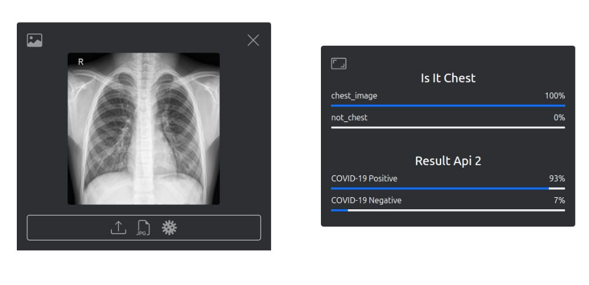
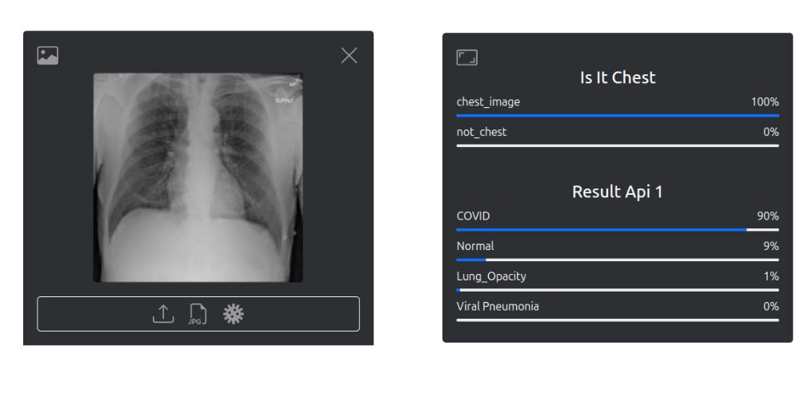

# Image Classification Project

This project utilizes the Ultralytics YOLO model for image classification tasks, focusing on fruit classification. Follow the instructions below to set up and use the project effectively.

## Prerequisites

Ensure you have Python 3.7 to 3.10 installed. This project requires the Ultralytics package and PyTorch (version 1.7 or higher).

## Installation

Install the required packages using pip. Run the following command:

```bash
pip install -r requirements.txt
```
## Upload Your Dataset

Prepare your dataset for training by specifying the path in your code. Update the following variable with the path to your dataset:

```python   
path = "path/to/your-dataset"
```

## Upload an Image for Testing
To test the model with a sample image, you can download an image using the following command:

```bash
!wget https://upload.wikimedia.org/wikipedia/commons/thumb/5/51/X-ray_of_lobar_pneumonia.jpg/220px-X-ray_of_lobar_pneumonia.jpg
```

## Running the Local API
To start the local API and get classification results, run the Flask application with the following command:

```bash 
python flask_app.py
```
## COVID-19 Detection Using Chest X-Ray Images
This project involves the classification of chest X-ray images to identify whether an image is of the chest and determine the likelihood of COVID-19 infection.



## COVID-19 Detection with Enhanced Classification
This project analyzes chest X-ray images to identify whether the image is of the chest and provides detailed predictions about potential conditions such as COVID-19, normal lungs, or other abnormalities.


